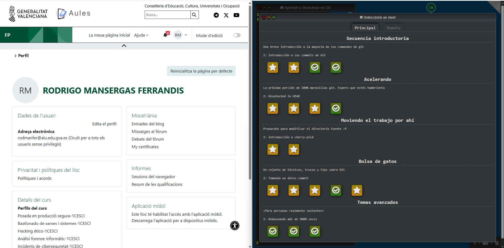
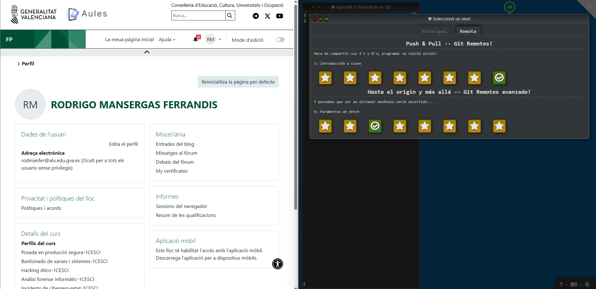

# Learn Git Branching - Tutorial de Control de Versiones

## Descripción General

Este documento presenta la realización completa del tutorial interactivo **Learn Git Branching**, una plataforma especializada en la enseñanza práctica de conceptos fundamentales de Git mediante una interfaz visual e interactiva.

### Información del Recurso

| Propiedad | Valor |
|-----------|-------|
| **Plataforma** | Web Interactiva |
| **URL** | [Learn Git Branching](https://learngitbranching.js.org/) |
| **Tipo de Aprendizaje** | Práctico y Visual |
| **Duración** | Variable según el ritmo del usuario |

## Conceptos Trabajados

La realización de este tutorial ha permitido el dominio de los siguientes conceptos fundamentales de Git:

- ✓ **Ramas (Branches)**: Creación, navegación y gestión de ramas paralelas
- ✓ **Commits**: Operaciones de confirmación y gestión del historial de cambios
- ✓ **Fusión de Ramas (Merge)**: Integración de cambios entre ramas diferentes
- ✓ **Rebase**: Reescritura de historial de commits con orden determinista
- ✓ **Repositorios Remotos**: Operaciones con servidores Git (push, pull, fetch)
- ✓ **Resolución de Conflictos**: Manejo de conflictos en fusiones y rebases

## Evidencias de Realización

Se presentan a continuación dos capturas de pantalla obtenidas al completar el tutorial, mostrando el estado final de los ejercicios en ambas vistas principales:

### Pestaña Main (Principal)

Captura de pantalla del estado de la rama principal (Main) tras completar los ejercicios básicos:

**Detalles visibles**:
- Estructura del árbol de commits completado
- Estado final de la rama Main
- Relaciones entre commits y ramas
- Historial visual de operaciones realizadas

### Pestaña Remote (Remota)

Captura de pantalla del estado de los repositorios remotos tras completar los ejercicios avanzados:

**Detalles visibles**:
- Sincronización entre repositorios local y remoto
- Estado de las ramas remotas (origin/main, etc.)
- Operaciones de push y pull completadas
- Estructura de trabajo distribuido

## Notas de Validación

### Autenticidad de las Evidencias

- ✓ Las imágenes adjuntas han sido capturadas directamente durante la realización del tutorial
- ✓ No se ha utilizado material externo ni capturas de terceros
- ✓ Las capturas incluyen evidencia visual de que fueron realizadas por el autor

### Metodología Seguida

- ✓ El tutorial se ha completado siguiendo el orden y los ejercicios propuestos por la plataforma
- ✓ Cada concepto fue practicado de forma incremental
- ✓ Se validó la comprensión mediante la interfaz interactiva del tutorial

## Información del Proyecto

| Propiedad | Valor |
|-----------|-------|
| **Autor** | Rodrigo Mansergas Ferrandis |
| **Asignatura** | Puesta en Producción Segura |
| **Centro** | IES CAMINAS |
| **Fecha de Realización** | Diciembre 2025 |