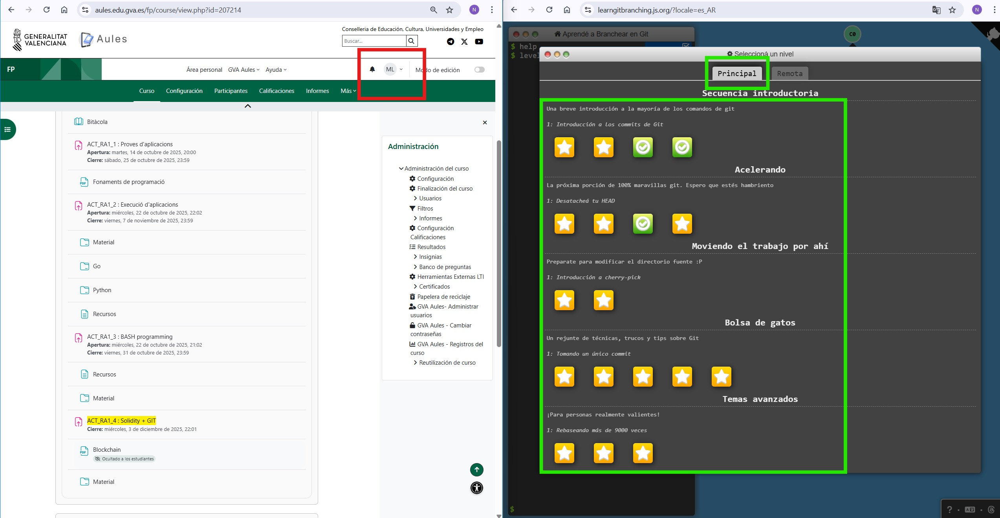

# Práctica Puntuable RA1 – PPS 25_26

---

## Apartado 1 (3 puntos)

Crea una app sencilla utilizando el lenguaje **Python** con temas relacionados con la **ciberseguridad** como puede ser la **criptografía**, por ejemplo.  
Realiza **4 test unitarios** para esta app.

---

## Apartado 2 (2 puntos)

Crea un **script en bash** que nos permita obtener:

- La **MAC** del equipo en el que se lanza.  
- El **sistema operativo** concreto en el que se ejecuta el script.  
- El **nombre del equipo** desde el que se lanza y el **usuario** que ha lanzado el script.

Todos estos datos deben verse en un **mensaje único** que los contenga a todos ellos en la consola.

---

## Apartado 3 (2,5 puntos)

Obtén un **pantallazo** de tus resultados obtenidos después de haber realizado el tutorial de la URL  
[https://learngitbranching.js.org/](https://learngitbranching.js.org/) que se solicitaba en la práctica de Aules **ACT_RA1_4: Solidity + GIT**.

Hay que obtener un pantallazo tanto para la pestaña **Main o Principal** como para la de **Remote o Remota**.  
En el pantallazo tiene que quedar claro de alguna forma que **el pantallazo lo hemos obtenido nosotros** y no es una imagen aleatoria.

A modo de ejemplo:

---

## Apartado 4 (2,5 puntos)

Obtén un **pantallazo** de tus resultados obtenidos después de haber realizado el tutorial **Solidity: Beginner to Intermediate Smart Contracts** de la práctica de Aules **ACT_RA1_4: Solidity + GIT**.

Al igual que en el apartado anterior, tiene que quedar claro que el pantallazo **se ha obtenido por nosotros** de nuestros resultados y no de otra fuente.

Realiza un **Smart Contract privado propio** que sea el inicio de una cadena que utilice los **árboles de decisión de Merkle (Merkle Trees)**.

---
---

## Consideraciones para la entrega

Todo el ejercicio tiene que **subirse de vuelta al repositorio de GIT original**, para que mediante el correspondiente **pull request** (que debes realizar) se solicite su integración dentro de la rama principal.

Para ello, todo tu ejercicio tiene que estar dentro de una carpeta con tu nombre y tus apellidos de la siguiente forma: **NOMBRE_APELLIDO1_APELLIDO2**.

Cada apartado debe tener su propio **`README.md`** (ojo: con ese nombre exacto), donde se explique **todo lo necesario para entender y ejecutar** aquello que se deba ejecutar o comprender en cada parte, sin dejar lugar a dudas.

El `README.md`, junto con el resto de información y documentación, debe dejar claro que **se dominan los conocimientos relativos a este Resultado de Aprendizaje (RA1)** que se evalúa.
